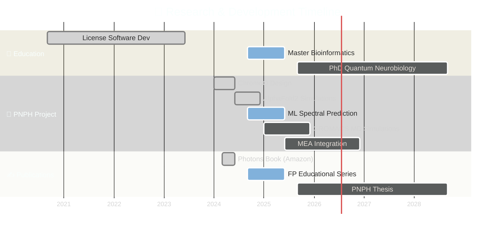

<h1 align="center">
  
</h1>

<p align="center">
  <a href="mailto:yannbanas@gmail.com">
    
  </a>
  <a href="https://www.linkedin.com/in/yann-banas-440a63156">
    
  </a>
  <a href="https://github.com/yannbanas">
    
  </a>
  <a href="https://discord.com/users/ybanas">
    
  </a>
</p>

<p align="center">
  
  
  
</p>

---

<br/>

<table align="center" border="0" cellspacing="0" cellpadding="0">
<tr>
<td width="50%" valign="top">

## 🧬 À Propos

```python
class QuantumBioinformatician:
    def __init__(self):
        self.name = "Yann Banas"
        self.role = "Systems & Networks Tech"
        self.location = "Le Creusot, France 🇫🇷"
        
        self.education = {
            "license": "Software Development",
            "thesis": "PNPH Doctoral Research",
            "specialty": "Quantum Neurobiology"
        }
        
        self.passion = [
            "Bioinformatics",
            "Photonics & Quantum",
            "Machine Learning",
            "Science Fiction Writing"
        ]
        
        self.hobbies = ["🦇 Caving", "🪂 Paragliding"]
    
    def current_focus(self):
        return "ChromoQ proteins + ML spectral prediction"
```

</td>
<td width="50%" valign="top">

## ⚡ Quick Stats

<p align="center">
  <picture>
    <source media="(prefers-color-scheme: dark)" srcset="https://github-readme-stats-sigma-five.vercel.app/api?username=yannbanas&show_icons=true&hide_border=true&bg_color=0a0f1a&title_color=00ffc8&text_color=8892b0&icon_color=7b5cff&ring_color=00ffc8&include_all_commits=true&count_private=true"/>
    
  </picture>
</p>

<p align="center">
  
</p>

</td>
</tr>
</table>

<br/>

---

<br/>

<h2 align="center">
  
</h2>

<br/>

---

<br/>

<h2 align="center">🚀 FLAGSHIP PROJECTS</h2>

<br/>

<p align="center">
  <a href="https://github.com/yannbanas/pnph">
    
  </a>
</p>

<br/>

<p align="center">
  <a href="https://github.com/yannbanas/fp-predict">
    
  </a>
</p>

<br/>

<p align="center">
  <a href="https://github.com/yannbanas/panlunadra">
    
  </a>
</p>

<br/>

<p align="center">
  <a href="https://github.com/yannbanas/optogeneticdb">
    
  </a>
</p>

<br/>

---

<br/>

<h2 align="center">📚 RESEARCH TIMELINE</h2>

<br/>



<br/>

---

<br/>

<h2 align="center">💻 TECH ARSENAL</h2>

<br/>

<p align="center">

<!-- Bioinformatics -->


</p>

<p align="center">

<!-- Quantum & ML -->


</p>

<p align="center">

<!-- Python Stack -->


</p>

<p align="center">

<!-- DevOps & Databases -->


</p>

<br/>

---

<br/>

<h2 align="center">📊 CONTRIBUTION ACTIVITY</h2>

<br/>

<p align="center">
  <picture>
    <source media="(prefers-color-scheme: dark)" srcset="https://github-readme-activity-graph.vercel.app/graph?username=yannbanas&bg_color=0a0f1a&color=00ffc8&line=7b5cff&point=ff6b9d&area=true&area_color=7b5cff&hide_border=true&custom_title=Contribution%20Graph"/>
    
  </picture>
</p>

<p align="center">
  <picture>
    <source media="(prefers-color-scheme: dark)" srcset="https://github-readme-stats-sigma-five.vercel.app/api/top-langs/?username=yannbanas&layout=compact&hide_border=true&bg_color=0a0f1a&title_color=00ffc8&text_color=8892b0&langs_count=8"/>
    
  </picture>
</p>

<br/>

---

<br/>

<h2 align="center">🌟 FEATURED REPOSITORIES</h2>

<br/>

<table align="center" border="0" cellspacing="10">
<tr>
<td align="center" width="50%">

### 📝 mrkdwn_analysis

<p>


</p>

Markdown document analysis and processing toolkit with advanced parsing capabilities.

<a href="https://github.com/yannbanas/mrkdwn_analysis">
  
</a>

</td>
<td align="center" width="50%">

### 🧬 ChromoQ Pipeline

<p>


</p>

Quantum-enhanced chromophore protein design pipeline for PNPH project.

<a href="https://github.com/yannbanas">
  
</a>

</td>
</tr>
</table>

<br/>

---

<br/>

<h2 align="center">📖 PUBLICATIONS & CONTENT</h2>

<br/>

<table align="center" border="0">
<tr>
<td align="center" width="33%">

### 📕 Book on Photons
<p align="center">

</p>

Educational book exploring the fascinating world of photons, quantum mechanics, and biophotonics.

</td>
<td align="center" width="33%">

### 📗 FP Educational Series
<p align="center">

</p>

Book series on fluorescent proteins, chromophores, biomineralization, and biophotonics.

</td>
<td align="center" width="33%">

### 📘 PNPH Thesis
<p align="center">

</p>

Doctoral thesis on Photonic-Neural Hybrid Platform and quantum neurobiology.

</td>
</tr>
</table>

<br/>

---

<br/>

<p align="center">
  
</p>

<p align="center">
  <i>"At the intersection of quantum physics and biology, we find the poetry of existence."</i>
</p>

<p align="center">
  <sub>💫 Made with passion by <b>Yann Banas</b> — Exploring the frontiers of science</sub>
</p>

<p align="center">
  
</p>
